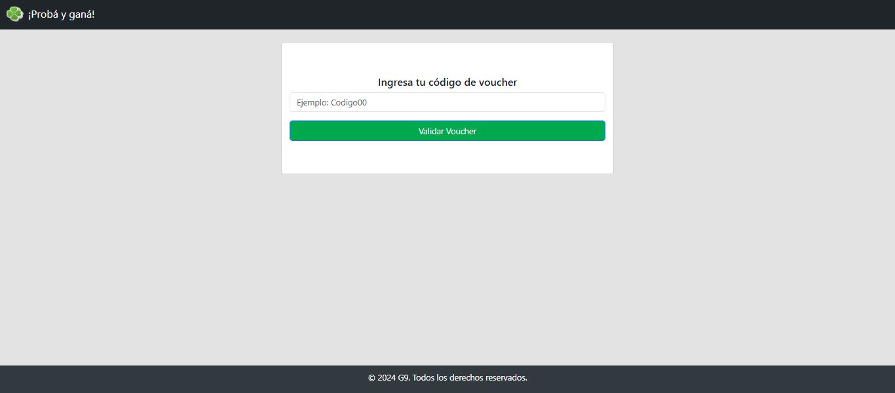
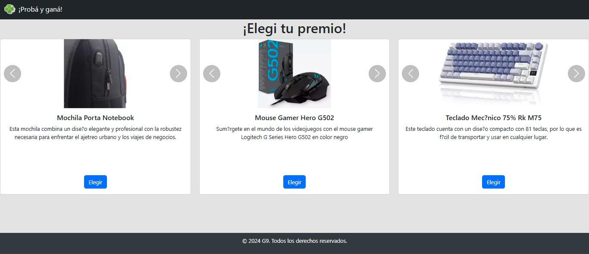

# Web Application for Voucher Redemption

## Description

This web application was developed using C# .NET Framework, JavaScript, TSQL, HTML, and CSS. It allows users to enter a voucher code, select the product they wish to participate with, and finally, complete a form with their personal details. If the user's information already exists in the database, the form is automatically pre-filled upon entering their ID number.

## Features

1. **Voucher Code Entry:**
   - Users enter a unique voucher code to participate in the promotion.

2. **Product Selection:**
   - Users choose the product they wish to participate with using their voucher.

3. **User Registration and Auto-Fill:**
   - Users complete a form with their personal details.
   - If the ID number is found in the database, the form is automatically pre-filled with existing user information.

## Requirements

- .NET Framework
- SQL Server
- Visual Studio

## Installation

1. Clone the repository:
   ```bash
   git clone https://github.com/your-username/voucher-redemption.git
   
2. **Create the Database**: Locate and execute the provided SQL script in the SQLScripts folder to create the database and necessary tables.

3. Open your C# IDE (e.g., Visual Studio or Visual Studio Code).

4. Open the solution in the IDE.

5. Initialize your connectionString variable inside the Web.config file. This will allow the application to connect to your database.

6. **Compile the solution**: In the IDE, select the option to compile the solution. This will ensure that all files are built correctly.

7. **Run the application**: After compiling, execute the application from the IDE.

8. Test its functionalities!


## Screenshots



